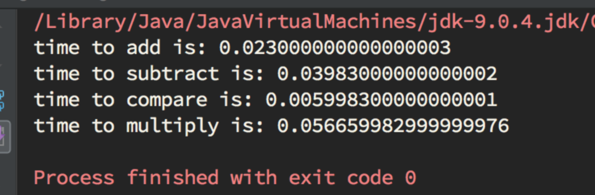
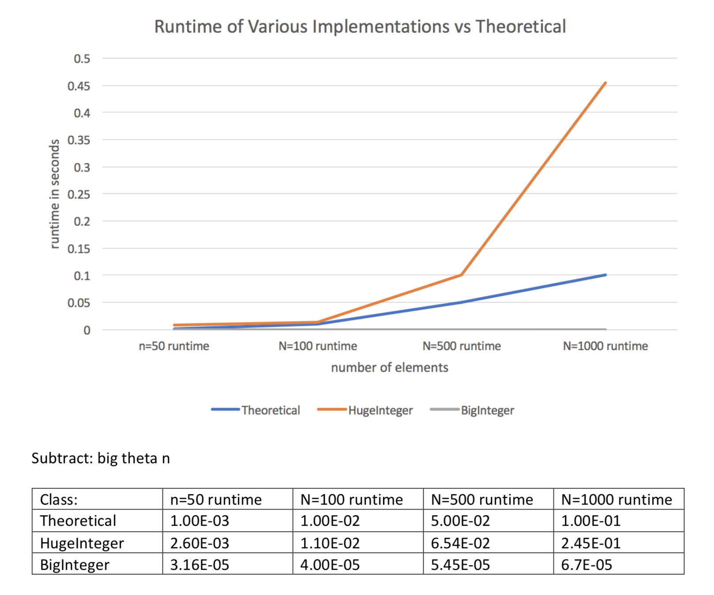
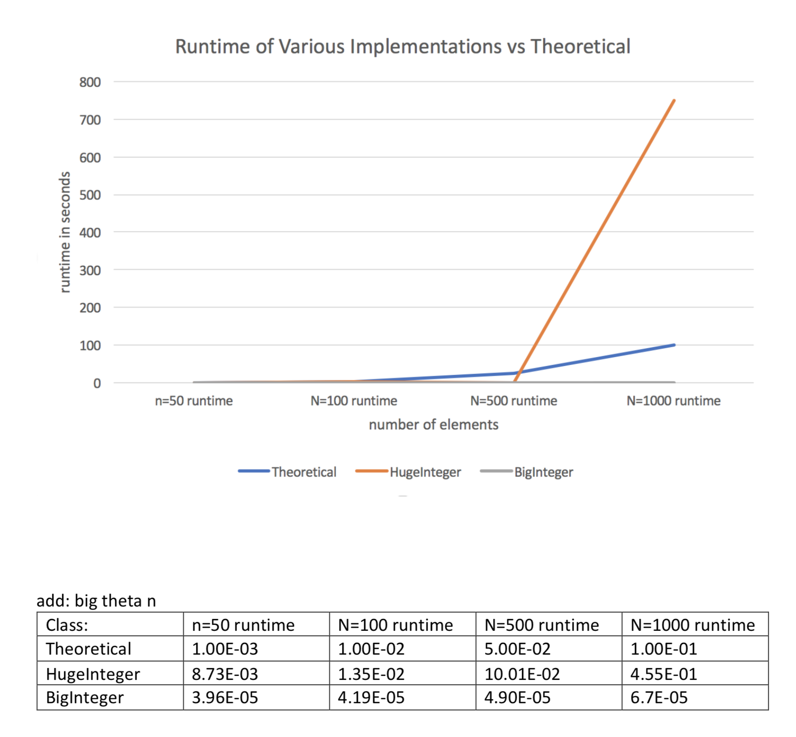
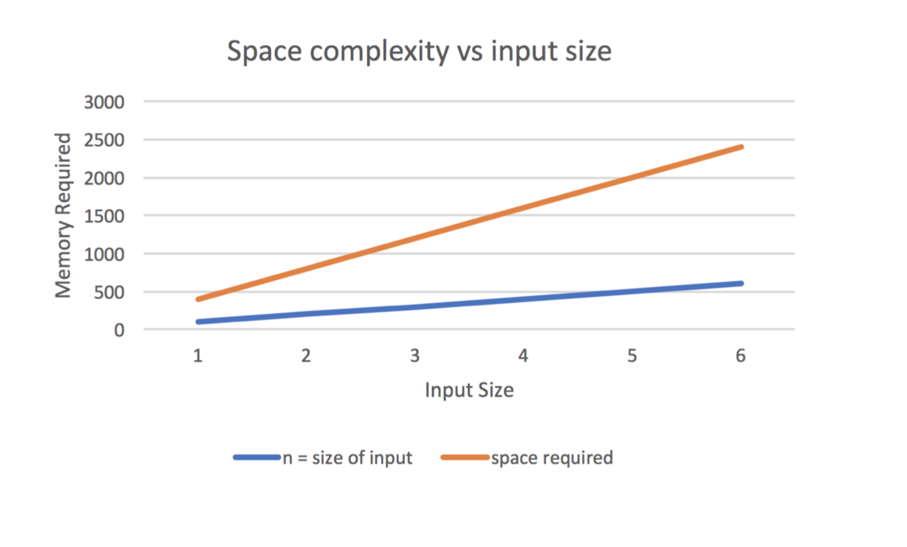

# Huge Integer

A new way to handle very large integers, i.e. trying to implement the Big Integer class on my own. This includes stuff like karat-suba algorithms for multiplication, etc. 

## Built With

* [IntelliJ](https://www.jetbrains.com/idea/) - IDE
* Java

## Runtime and Space Analysis

## Authors

* **Ahmed Fuad Ali** 

## Acknowledgments

* Inspiration: Dr. Hralinovic at McMaster University and his lab assignments
